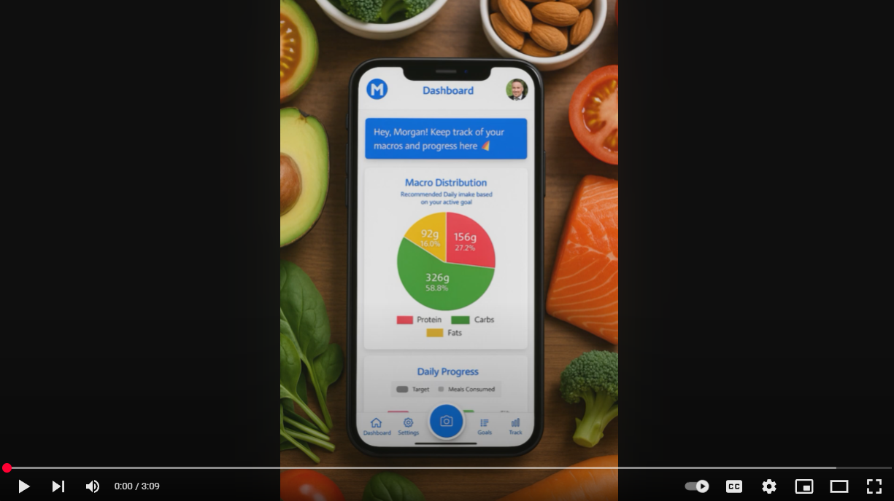
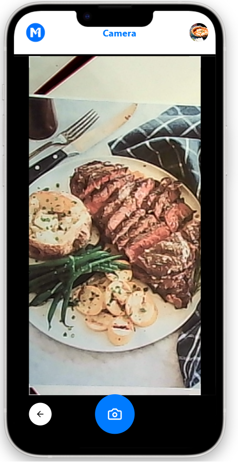
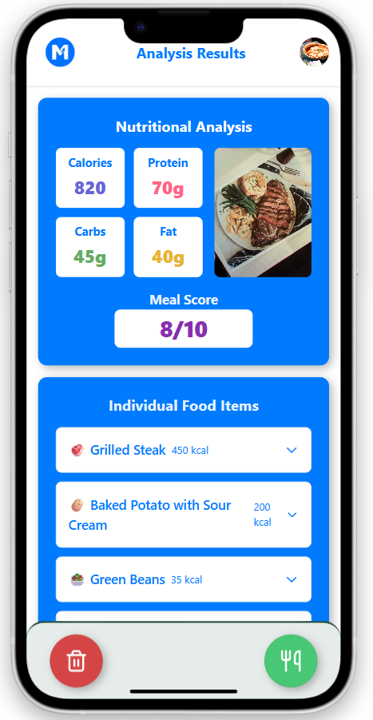
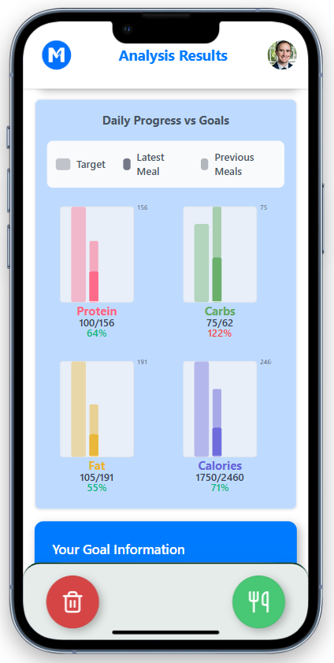
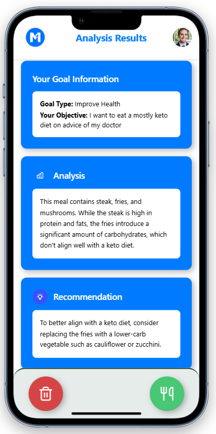
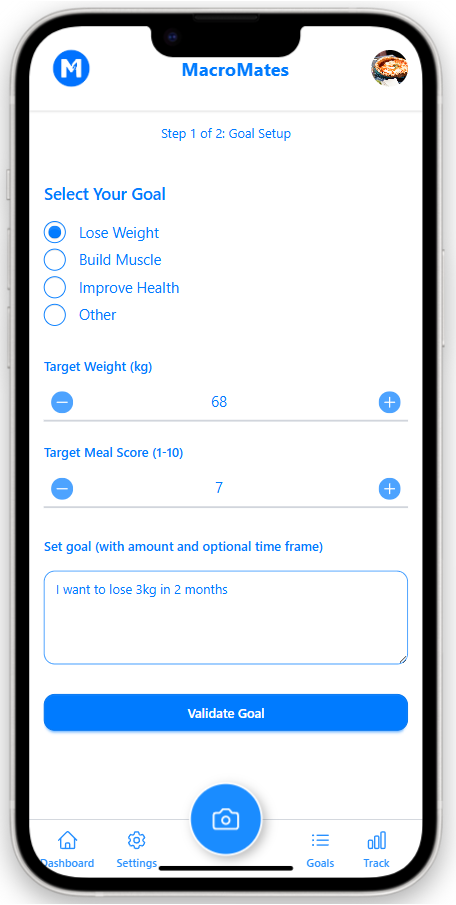
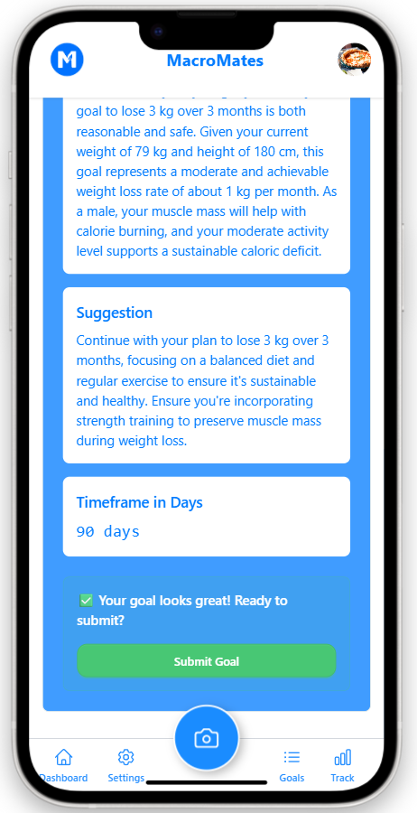
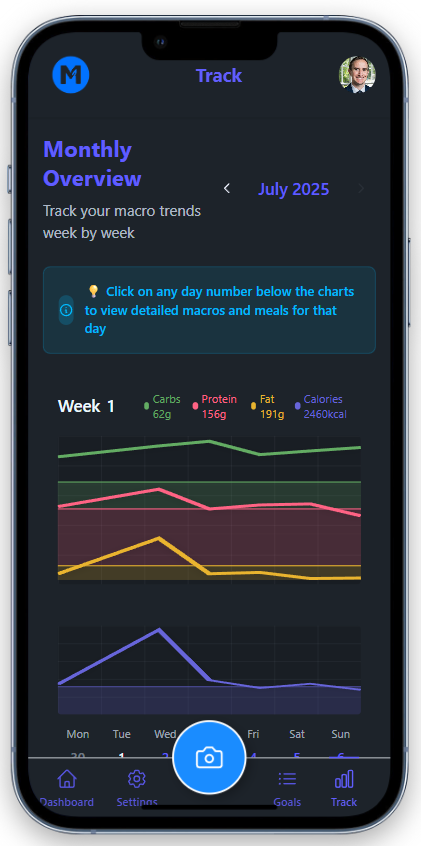
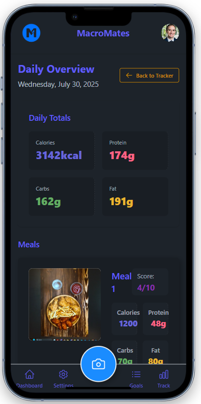

# MacroMates

**Effortless Meal & Macronutrient Tracking Powered by AI**

## Live Demo

You can access the deployed version of MacroMates here:  
[https://macromates.ch/](https://macromates.ch/)

## 🎥 Demo Video

▶️ **Click below to see MacroMates in action**  
<a href="https://www.youtube.com/watch?v=_grQ8WPekds" target="_blank">

</a>

## Overview

**MacroMates** is an innovative health and nutrition platform designed to help users set, track, and achieve their dietary goals with ease. By leveraging AI and a modern tech stack, MacroMates streamlines the process of meal logging and macro tracking, making healthy eating accessible and sustainable for everyone.

---

## Key Features:

- **AI-Powered Meal Analysis:** Snap a photo of your meal and instantly receive detailed macronutrient and calorie breakdowns.
<p align="center">
  
  
</p>

- **Personalized Insights:** Meal scores and recommendations are tailored to each user's biometric data and nutrition goals.
<p align="center">
  
  
</p>

- **Natural Language Goal Setting:** Set goals like “I want to lose 5kg in 2 months” and receive smart, realistic suggestions.
<p align="center">
  
  
</p>

- **Visual Progress Tracking:** Interactive charts, graphs, and dashboards to monitor daily, weekly, and monthly macro intake.
<p align="center">
  
  
</p>

- **Historical Data:** Analyze trends and patterns in your eating habits over time.

---

## Problem Statement

Traditional nutrition tracking apps require tedious manual entry, leading to abandoned goals and poor long-term results. MacroMates solves this by automating meal logging and providing instant, personalized feedback, making nutrition tracking both effective and enjoyable.

---

## How MacroMates Works

1. **Set Your Goals:** Define clear objectives in natural language (e.g., “I want to lose 5 kg in 2 months”). AI refines and validates these goals with personalized suggestions and realistic timelines.
2. **Log Meals Instantly:** Snap a photo of your meal; AI instantly analyzes the contents, calculating calories and macronutrients.
3. **Get Personalized Feedback:** Receive insights and meal scores tailored to your biometrics, age, and goals.
   - Example: The same plate of fries may score lower for an older user reducing cholesterol but higher for a younger athlete aiming to bulk.
4. **Track Progress:** Visualize your macro intake and goal achievement with intuitive dashboards.

---

## Tech Stack

| Layer    | Technology                                                 |
| -------- | ---------------------------------------------------------- |
| Frontend | React, Vite, Tailwind CSS, DaisyUI, Chart.js, React Webcam |
| Backend  | Django REST Framework                                      |
| Database | PostgreSQL                                                 |
| AI       | OpenAI API Integration                                     |
| DevOps   | Docker, GitLab CI/CD, Digital Ocean                        |

---

## Architecture & Codebase

The project is organized as a **monorepo** with clear separation of concerns:

```
macromates/
├── backend/      # Django REST API: authentication, user profiles, food items, goals, AI integration
│   ├── authentication/
│   ├── customUser/
│   ├── foodItem/
│   ├── foodPhoto/
│   ├── userday/
│   ├── usergoal/
│   ├── usermonth/
│   ├── project/  # Django settings & routing
│   └── manage.py
├── frontend/     # React SPA: UI components, pages, state management, webcam integration
│   ├── src/
│   │   ├── components/
│   │   ├── pages/
│   │   ├── store/
│   │   └── ...
│   ├── public/
│   └── index.html
├── assets/       # Images, videos, documentation
├── nginx/        # Reverse proxy configuration
├── scripts/      # Dev/prod shell scripts
├── Dockerfile    # Backend containerization
├── docker-compose.yml
└── README.md     # Project documentation
```

**Highlights:**

- **AI Integration:** `usergoal/ai_utils.py` connects to OpenAI for meal analysis and goal validation.
- **Custom User Model:** Extensible user profiles for personalized recommendations.
- **RESTful API:** Modular endpoints for authentication, meal logging, goal management, and analytics.
- **Frontend:** Modern React architecture with Vite for fast builds, Tailwind/DaisyUI for styling, and Chart.js for data visualization.
- **DevOps:** Dockerized deployment, GitLab CI/CD pipelines, and Nginx for production-grade hosting.

---

## Getting Started

### Prerequisites

- Docker & Docker Compose
- Node.js & npm (for frontend development)
- Python 3.10+ (for backend development)
- PostgreSQL

### Local Development

**Backend:**

```bash
cd backend
python -m venv venv
source venv/bin/activate
pip install -r requirements.yml
python manage.py migrate
python manage.py runserver
```

**Frontend:**

```bash
cd frontend
npm install
npm run dev
```

**Full Stack (Docker):**

```bash
docker-compose up --build
```

---

## AI Integration

MacroMates leverages OpenAI to:

- Analyze meal photos and estimate macronutrient content.
- Parse and validate user goals set in natural language.
- Provide personalized feedback based on user health profiles.

---

## Roadmap

- **Gamification:** Rewards, achievement badges, and streaks.
- **Enhanced AI:** Improved accuracy for food recognition and macro estimation.
- **Community Features:** Social sharing, group challenges, support forums.
- **Integrations:** Sync with wearables, health apps, and barcode scanning.

---

## Team

**Joel Gamonez**  
**Rudolf Cardol**  
**Nomi Lang**

---

## Contact

For questions, feedback, or collaboration opportunities, please reach out via [GitHub Issues](https://github.com/your-repo/macromates/issues) or email to macromates25@gmail.com

---

**MacroMates – Empowering healthy habits through AI and intuitive design.**

---

_This README is designed to provide a comprehensive, professional overview for potential employers, contributors, and users. For more details, see the [MacroMates Blog](assets/MacroMates%20Blog.pdf)._
